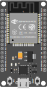

## DoIT ESP32 DEVKIT V1 
## ESP-WROOM-32
### FCC ID: 2AC7Z-ESPWROOM32

### Links: 
- [ESP32 Wikipedia](https://en.wikipedia.org/wiki/ESP32)
- [BME280 - Czujnik wilgotności, ciśnienia i temperatury - Podpięcie do Arduino](https://blog.elektroweb.pl/bme280-czujnik-wilgotnosci-cisnienia-i-temperatury-podpiecie-do-arduino/)

